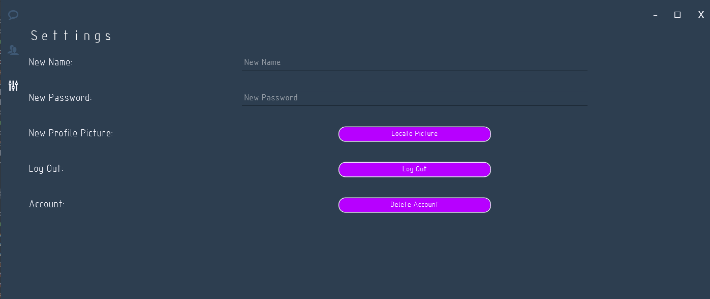

# ChatApp

## De

hie ist das Repository meiner Chat App, diese besteht im Detail aus einem WPF-Projekt, 
einer c# Libary und einer API die mit einem Grpc Service zusammengeschmolzen ist.

#### Ps: 
Dies hier ist ein **Übungs / Hobby Projekt** von mir und behandelt datenschutzt,
Cybersecurity **nicht** da dieses Projekt mehr für mich diente, ein bisschen tiefer in die 
c# Thematik zu tauchen und mehr in diesem Bereich der Software Entwicklung zu lernen.

## En
Here is the repository of my chat app, which consists of a WPF project,
a libary and an API which is merged with a Grpc service 

#### Note:
this is an **exercise / hobby project** of mine and **does not** deal with data protection,
cybersecurity as this project was more for me to dive a little deeper into the
c# topic and to learn more in this area of software development 

## Pictures from Software:
 
#### Here is the Login / Register Window: 

#### The chat field 

#### Contact Settings  

#### Adding New Contact

#### Settings 

